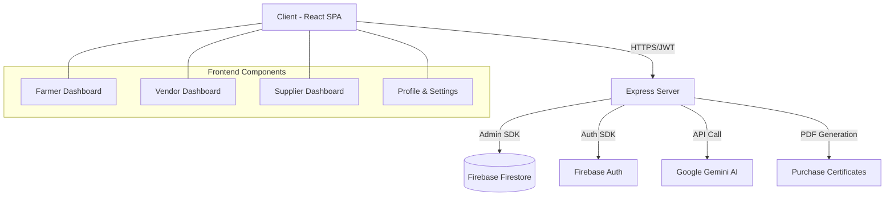
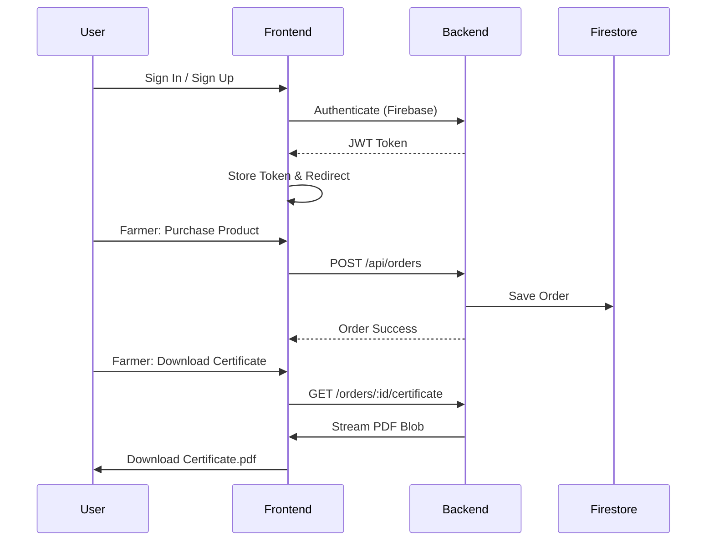

# 🌾 CropKart: Empowering Agriculture through Technology

CropKart is a comprehensive full-stack agricultural platform designed to bridge the gap between farmers, vendors, and suppliers. By leveraging modern web technologies and AI, CropKart provides a seamless ecosystem for crop management, marketplace interactions, and supply chain transparency.


## 🚀 Key Features

### 👨‍🌾 For Farmers
- **Crop Management**: List and manage crops with real-time status updates.
- **Marketplace Access**: Purchase essential agricultural products directly from suppliers.
- **AI Insights**: Get data-driven recommendations for crop health and market trends using Gemini AI.
- **Authenticity Certificates**: Download "CropKart Verified" certificates for every purchase to ensure product quality.
- **Subscription Model**: Manage recurring crop supply contracts with vendors.

### 🏢 For Vendors
- **Crop Discovery**: Browse a wide variety of fresh crops listed by local farmers.
- **Subscription Management**: Secure long-term supply chains by subscribing to specific crops.
- **Direct Communication**: Connect with farmers for transparent transactions.

### 🚚 For Suppliers
- **Inventory Control**: Manage a catalog of agricultural products (seeds, fertilizers, tools).
- **Sales Tracking**: Monitor product performance and stock levels.
- **Global Reach**: Reach a wide network of farmers looking for quality inputs.

---

## 🛠️ Tech Stack

| Layer | Technology |
| :--- | :--- |
| **Frontend** | React 19, Vite, Tailwind CSS, Motion (Animations) |
| **Backend** | Node.js, Express, TSX |
| **Database** | Firebase Firestore |
| **Authentication** | Firebase Auth (JWT) |
| **AI Integration** | Google Gemini API (@google/genai) |
| **PDF Generation** | PDFKit |
| **Icons** | Lucide React |

---

## 📊 System Architecture



---

## 🔄 User Flow




---

## ⚙️ Installation & Setup

### Prerequisites
- Node.js (v18+)
- Firebase Project
- Google AI Studio API Key (for Gemini)

### 1. Clone the Repository
```bash
git clone https://github.com/your-username/cropkart.git
cd cropkart
```

### 2. Install Dependencies
```bash
npm install
```

### 3. Environment Configuration
Create a `.env` file in the root directory:
```env
GEMINI_API_KEY=your_gemini_api_key
# Firebase config is handled via firebase-applet-config.json
```

### 4. Run the Application
```bash
npm run dev
```
The app will be available at `http://localhost:3000`.

---

## 🛡️ Security
- **JWT Authentication**: All sensitive routes are protected by Firebase Auth tokens.
- **Firestore Rules**: Strict security rules ensure users can only access their own data.
- **Input Validation**: Backend validation for all crop and product listings.

---

## 📄 License
This project is licensed under the MIT License - see the [LICENSE](LICENSE) file for details.

---

Developed with ❤️ for the Agricultural Community.
